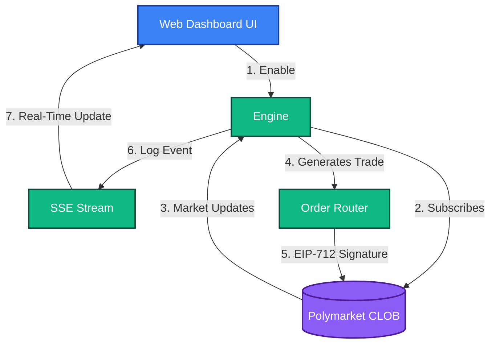

# AI Forecast Strategy (Research Driven)
**Strategy ID:** `ai_forecast`

## 📖 Overview
Ingests news articles, tweets, and macro data, feeding it to an LLM subagent to generate predictive scoring before market consensus.

---

## 🏗️ Front-End / Back-End Workflow

This diagram illustrates the lifecycle of this strategy, from data ingestion to UI reflection.



---

## 🔍 Detailed Decision Flow Diagram

```mermaid
flowchart TD
    A([Trigger Event / Cron]) --> B[Ingest Firehose (News, X/Twitter, Macro)]
    B --> C[Pass Context to LLM Subagent]
    C --> D[LLM analyzes sentiment & ground truth]
    D --> E{LLM Conviction Score > 85%?}
    E -- No --> Z([Discard Signal])
    E -- Yes --> F[Fetch current Polymarket Odds]
    F --> G{Polymarket Price < LLM Probability?}
    G -- No --> Z
    G -- Yes --> H[Calculate Kelly Criterion Sizing]
    H --> I{Risk Engine: Max Exposure Check}
    I -- No --> Z
    I -- Yes --> J[Execute Directional Order]
    J --> K([Log Prediction to Scrubber])
```

---

## 📥 Inputs and 📤 Outputs

### Data Inputs (In)
- **Primary Source:** Real-time News Feeds, X/Twitter Firehose, Polymarket Event Metadata
- **Environment:** `Live` or `Paper` state.
- **Risk Limits:** Max Drawdown, Max Position Size from Wallet Config.

### Data Outputs (Out)
- **Trade Signal:** Directional Bet (YES/NO) + LLM Conviction Score (0.0 - 1.0)
- **Telemetry:** Logs routed to `AgentScrubber` (lessons_learned.md) on failure or success.