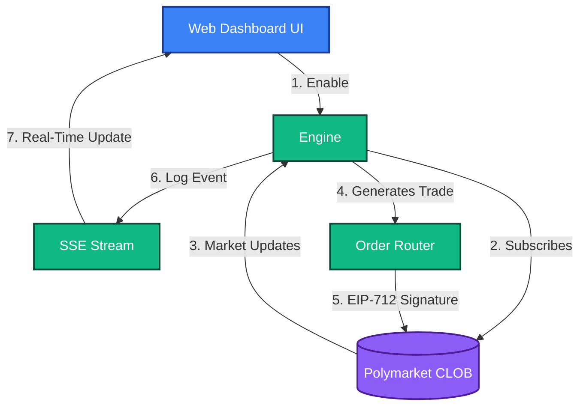

# Whale Copy Trading Strategy
**Strategy ID:** `copy_trade`

## 📖 Overview
Shadows successful on-chain addresses. When a tracked wallet executes a trade, this strategy replicates it proportionally.

---

## 🏗️ Front-End / Back-End Workflow

This diagram illustrates the lifecycle of this strategy, from data ingestion to UI reflection.



---

## 🔍 Detailed Decision Flow Diagram

```mermaid
flowchart TD
    A([Blockchain Mempool Event]) --> B{Did Tracked Whale Wallet interact with CTF Exchange?}
    B -- No --> Z([Ignore])
    B -- Yes --> C[Parse Transaction Data (Market, Outcome, Size)]
    C --> D{Check Whale Profiler Database}
    D --> E{Whale Win Rate > 50% & Not Cooled Down?}
    E -- No --> Y([Skip / Whale in Penalty Box])
    E -- Yes --> F[Calculate Proportional Sizing (e.g. 1% of Whale Size)]
    F --> G{Risk Engine: Anti-Martingale / Max Daily Loss Check}
    G -- No --> Z
    G -- Yes --> H[Execute Mirrored Order instantly]
    H --> I([Track Copied Position for Exit])
```

---

## 📥 Inputs and 📤 Outputs

### Data Inputs (In)
- **Primary Source:** Polygon RPC Mempool Data, Polymarket Proxy Wallet activity
- **Environment:** `Live` or `Paper` state.
- **Risk Limits:** Max Drawdown, Max Position Size from Wallet Config.

### Data Outputs (Out)
- **Trade Signal:** Mirrored Directional Signal with Proportional Sizing
- **Telemetry:** Logs routed to `AgentScrubber` (lessons_learned.md) on failure or success.