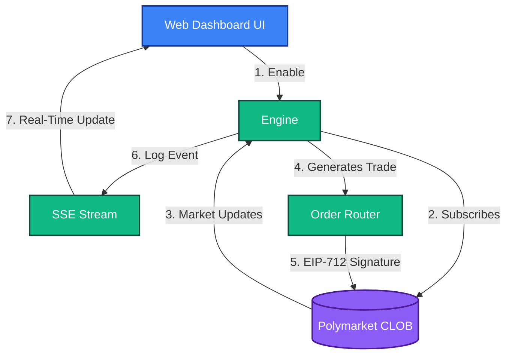

# Cross Market Arbitrage Strategy
**Strategy ID:** `cross_market_arbitrage`

## 📖 Overview
Exploits price discrepancies between Polymarket and external markets (like Binance) by detecting lagging orderbooks.

---

## 🏗️ Front-End / Back-End Workflow

This diagram illustrates the lifecycle of this strategy, from data ingestion to UI reflection.



---

## 🔍 Detailed Decision Flow Diagram

```mermaid
flowchart TD
    A([Start Tick]) --> B{Fetch External Oracle (e.g. Binance)}
    B --> C{Fetch Polymarket Orderbook}
    C --> D[Calculate Implied Price Delta]
    D --> E{Is Delta > Spread Threshold?}
    E -- No --> Z([Wait for next tick])
    E -- Yes --> F{Is Orderbook Depth sufficient?}
    F -- No --> Z
    F -- Yes --> G[Calculate Optimal Sizing / Hedge Ratio]
    G --> H{Risk Engine: Passes Legging Moat?}
    H -- No --> Z
    H -- Yes --> I[Dispatch Atomic Trade]
    I --> J[Buy Asset on External CEX]
    I --> K[Buy YES/NO on Polymarket]
    J --> L([Trade Logged])
    K --> L
```

---

## 📥 Inputs and 📤 Outputs

### Data Inputs (In)
- **Primary Source:** MarketData (Prices, Orderbook Depth) + External Oracle Data (Binance, CEX feeds)
- **Environment:** `Live` or `Paper` state.
- **Risk Limits:** Max Drawdown, Max Position Size from Wallet Config.

### Data Outputs (Out)
- **Trade Signal:** Atomic Trade Legs (Simultaneous Limit Orders) with calculated Hedge ratios
- **Telemetry:** Logs routed to `AgentScrubber` (lessons_learned.md) on failure or success.