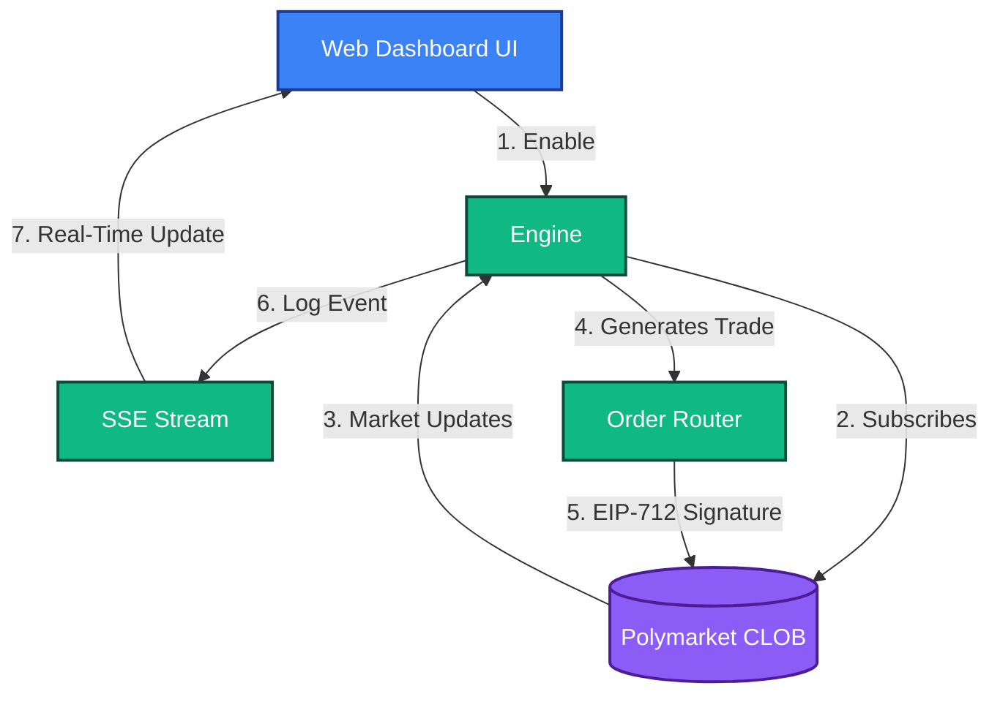

# Filtered High Probability Convergence
**Strategy ID:** `filtered_high_prob_convergence`

## 📖 Overview
Targets markets heavily skewed (>95% prob) nearing resolution, sweeping up pennies with massive capital sizing.

---

## 🏗️ Front-End / Back-End Workflow

This diagram illustrates the lifecycle of this strategy, from data ingestion to UI reflection.



---

## 🔍 Detailed Decision Flow Diagram

```mermaid
flowchart TD
    A([Start Tick]) --> B[Filter Active Markets]
    B --> C{Days to Resolution < 7?}
    C -- No --> Z([Skip Market])
    C -- Yes --> D{Current Price > $0.95?}
    D -- No --> Z
    D -- Yes --> E[Calculate Implied Annualized Yield (APY)]
    E --> F{Is APY > Target Hurdle Rate (e.g. 15%)?}
    F -- No --> Z
    F -- Yes --> G[Calculate Heavy Capital Allocation]
    G --> H{Risk Engine: Portfolio Drawdown Check}
    H -- No --> Z
    H -- Yes --> I[Place Limit Order at $0.96 / $0.97]
    I --> J([Hold to Resolution])
```


### 📝 Step-by-Step Breakdown
1. **Time Filtering:** The engine scans the market registry for active events that resolve in less than 7 days.
2. **Probability Filtering:** It filters out any outcome currently trading below 95 cents (hunting for >95% implied probability "sure things").
3. **Yield Calculation:** It calculates the Annualized Percentage Yield (APY) of locking capital into this asset until resolution.
4. **Hurdle Rate Check:** If the APY clears the target hurdle rate (e.g., 15%), it triggers a massive capital allocation.
5. **Risk Firewall:** The Risk Engine verifies global portfolio drawdown limits.
6. **Yield Harvesting:** If approved, it places heavy limit orders at $0.96 or $0.97 to harvest yield until the market resolves.


---

## 📥 Inputs and 📤 Outputs

### Data Inputs (In)
- **Primary Source:** Days to Resolution, Implied Probability (>0.95), APY Yield calculations
- **Environment:** `Live` or `Paper` state.
- **Risk Limits:** Max Drawdown, Max Position Size from Wallet Config.

### Data Outputs (Out)
- **Trade Signal:** High-Size / Low-Yield Limit Order
- **Telemetry:** Logs routed to `AgentScrubber` (lessons_learned.md) on failure or success.