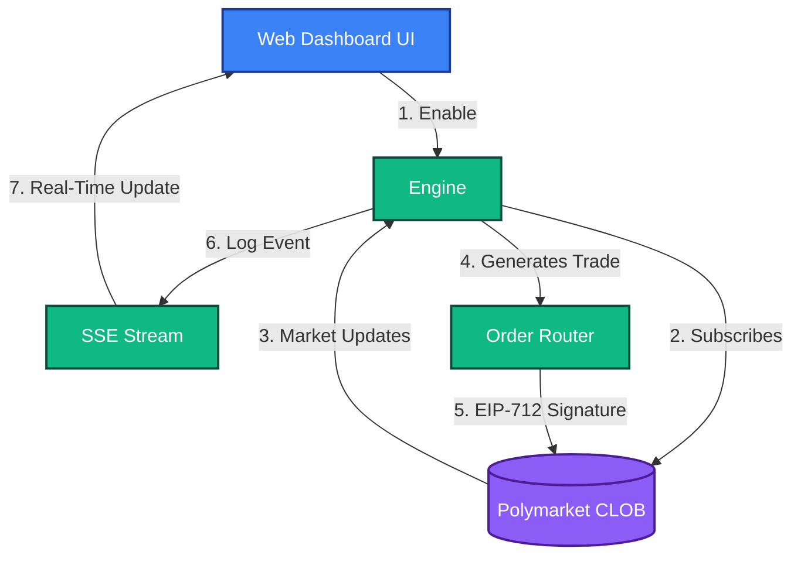

# Market Making (Spread Strategy)
**Strategy ID:** `market_making`

## 📖 Overview
Provides liquidity to both sides of the book. Uses Inventory Skew (Avellaneda-Stoikov model) to mitigate directional risk.

---

## 🏗️ Front-End / Back-End Workflow

This diagram illustrates the lifecycle of this strategy, from data ingestion to UI reflection.



---

## 🔍 Detailed Decision Flow Diagram

```mermaid
flowchart TD
    A([Start Tick]) --> B[Fetch Market Mid-Price]
    B --> C[Fetch Current Wallet Inventory (YES/NO Exposure)]
    C --> D[Calculate Inventory Skew]
    D --> E{Is Inventory heavily skewed?}
    E -- Yes --> F[Shift Asks down to incentivize selling]
    E -- No --> G[Keep Bids/Asks symmetrical around mid]
    F --> H[Calculate New Ladder (Levels & Spreads)]
    G --> H
    H --> I{Are existing active orders > 2% away from new target?}
    I -- No --> Z([Do Nothing, wait])
    I -- Yes --> J[Cancel Old Orders]
    J --> K{Risk Engine: MM Spam Check (Max 500/min)?}
    K -- No --> Y([Throttle / Pause])
    K -- Yes --> L[Dispatch New Maker Limit Orders]
    L --> M([Update Resting Book])
```

---

## 📥 Inputs and 📤 Outputs

### Data Inputs (In)
- **Primary Source:** Live Orderbook (L2), Current Inventory (Position Size on YES/NO)
- **Environment:** `Live` or `Paper` state.
- **Risk Limits:** Max Drawdown, Max Position Size from Wallet Config.

### Data Outputs (Out)
- **Trade Signal:** Maker Limit Orders (Laddered Bids & Asks)
- **Telemetry:** Logs routed to `AgentScrubber` (lessons_learned.md) on failure or success.