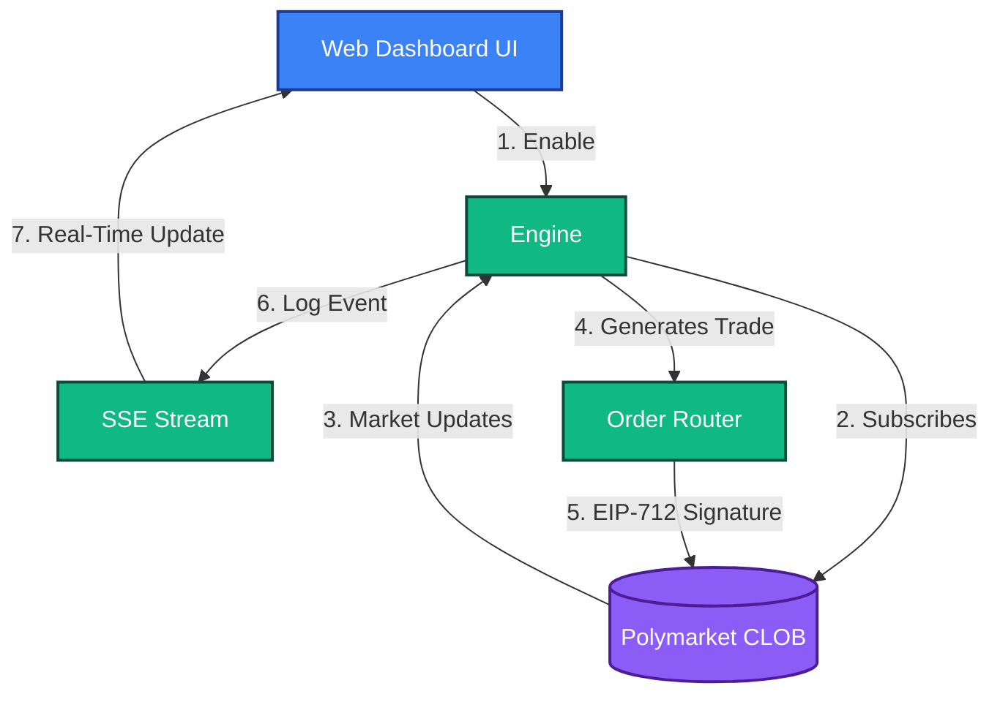

# Mispricing Arbitrage Detector
**Strategy ID:** `mispricing_arbitrage`

## 📖 Overview
Scans all active Gamma markets to detect situations where YES + NO mathematically do not equal 1.00 ($1) minus fees.

---

## 🏗️ Front-End / Back-End Workflow

This diagram illustrates the lifecycle of this strategy, from data ingestion to UI reflection.



---

## 🔍 Detailed Decision Flow Diagram

```mermaid
flowchart TD
    A([Start Tick]) --> B[Fetch Gamma Market Orderbook]
    B --> C[Get Best YES Ask]
    B --> D[Get Best NO Ask]
    C --> E[Sum = YES Ask + NO Ask]
    D --> E
    E --> F{Is Sum < (1.00 - Exchange Fees)?}
    F -- No --> Z([Wait for next tick])
    F -- Yes --> G[Calculate Max Extractable Value (MEV)]
    G --> H{Are both sides fully matched in depth?}
    H -- No --> I[Reduce Order Size to bottleneck leg]
    H -- Yes --> J[Construct Dual-Order Payload]
    I --> J
    J --> K{Risk Engine: Legging Moat check}
    K -- No --> Z
    K -- Yes --> L[Execute simultaneous YES and NO buys]
    L --> M([Lock in Risk-Free Profit])
```

---

## 📥 Inputs and 📤 Outputs

### Data Inputs (In)
- **Primary Source:** Live Clob Orderbook (Bid/Ask Spreads for all outcomes in a market)
- **Environment:** `Live` or `Paper` state.
- **Risk Limits:** Max Drawdown, Max Position Size from Wallet Config.

### Data Outputs (Out)
- **Trade Signal:** Risk-Free Arbitrage Execution Signal (Buy YES + Buy NO simultaneously)
- **Telemetry:** Logs routed to `AgentScrubber` (lessons_learned.md) on failure or success.