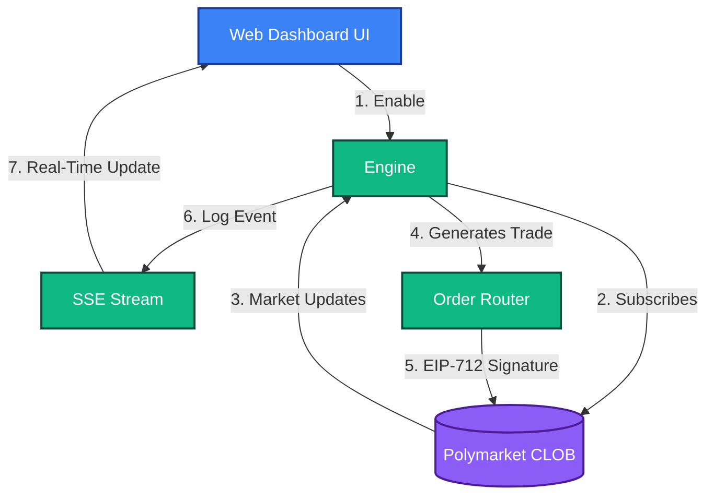

# Trend / Momentum Strategy
**Strategy ID:** `momentum`

## 📖 Overview
Rides price spikes. Detects sudden volume influxes and buys in the direction of the momentum before it stabilizes.

---

## 🏗️ Front-End / Back-End Workflow

This diagram illustrates the lifecycle of this strategy, from data ingestion to UI reflection.



---

## 🔍 Detailed Decision Flow Diagram

```mermaid
flowchart TD
    A([Start Tick]) --> B[Read 1m/5m/15m Volume Profiles]
    B --> C[Calculate Order Flow Imbalance]
    C --> D{Is Volume Spike > 300% of Moving Avg?}
    D -- No --> Z([Wait])
    D -- Yes --> E[Calculate Price Delta / Direction]
    E --> F{Is Delta breaching resistance?}
    F -- No --> Z
    F -- Yes --> G[Calculate Aggressive Entry Size]
    G --> H{Risk Engine: Martingale / Overexposure Check}
    H -- No --> Z
    H -- Yes --> I[Dispatch Aggressive Limit Order (Crossing Spread)]
    I --> J([Monitor for trailing stop exit])
```

---

## 📥 Inputs and 📤 Outputs

### Data Inputs (In)
- **Primary Source:** Volume Profiles (1m/5m/15m), Price Deltas, Order Flow Imbalance
- **Environment:** `Live` or `Paper` state.
- **Risk Limits:** Max Drawdown, Max Position Size from Wallet Config.

### Data Outputs (Out)
- **Trade Signal:** Directional Market/Aggressive Limit Order
- **Telemetry:** Logs routed to `AgentScrubber` (lessons_learned.md) on failure or success.