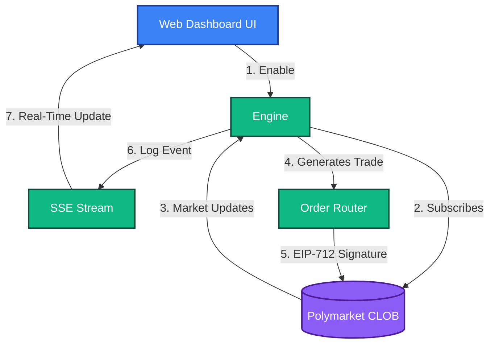
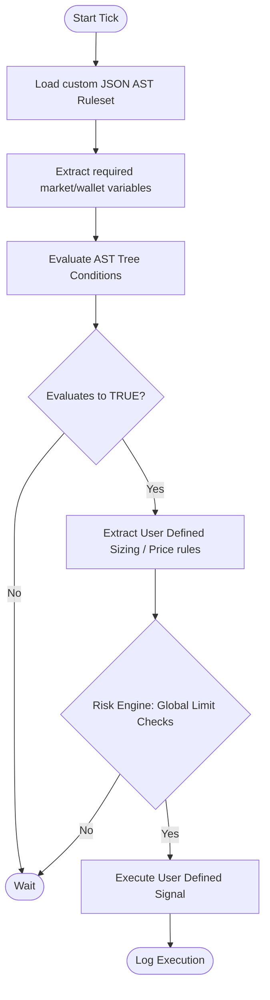

# Custom User Defined Strategy
**Strategy ID:** `user_defined`

## 📖 Overview
A sandboxed strategy template where the user can define ad-hoc rules without modifying core engine logic.

---

## 🏗️ Front-End / Back-End Workflow

This diagram illustrates the lifecycle of this strategy, from data ingestion to UI reflection.

---

## 🔍 Detailed Decision Flow Diagram

### 📝 Step-by-Step Breakdown
1. **Load Ruleset:** The bot loads your custom JSON AST (Abstract Syntax Tree) configuration.
2. **Extract Variables:** It dynamically fetches whatever live variables you requested in your config (e.g., specific prices, wallet balances, or time constraints).
3. **Evaluate:** It mathematically evaluates your custom AST conditions against the live data.
4. **Signal Generation:** If the conditions evaluate to `TRUE`, it extracts your defined sizing and pricing rules.
5. **Risk Firewall:** The custom signal is passed through the standard Global Risk Engine limits (Daily Loss, Drawdown limits) to prevent human-error blowups.
6. **Execution:** If mathematically safe, your custom trade executes.

---

## 📥 Inputs and 📤 Outputs

### Data Inputs (In)
- **Primary Source:** JSON Config Parameters, Evaluated Expressions
- **Environment:** `Live` or `Paper` state.
- **Risk Limits:** Max Drawdown, Max Position Size from Wallet Config.

### Data Outputs (Out)
- **Trade Signal:** User-specified Signal
- **Telemetry:** Logs routed to `AgentScrubber` (lessons_learned.md) on failure or success.