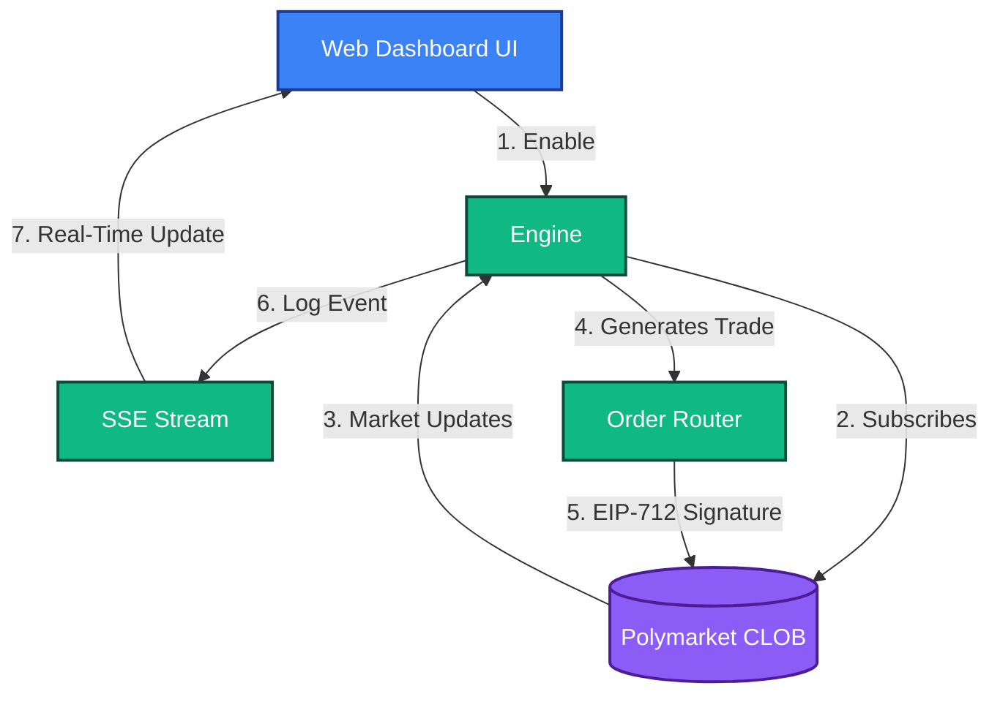
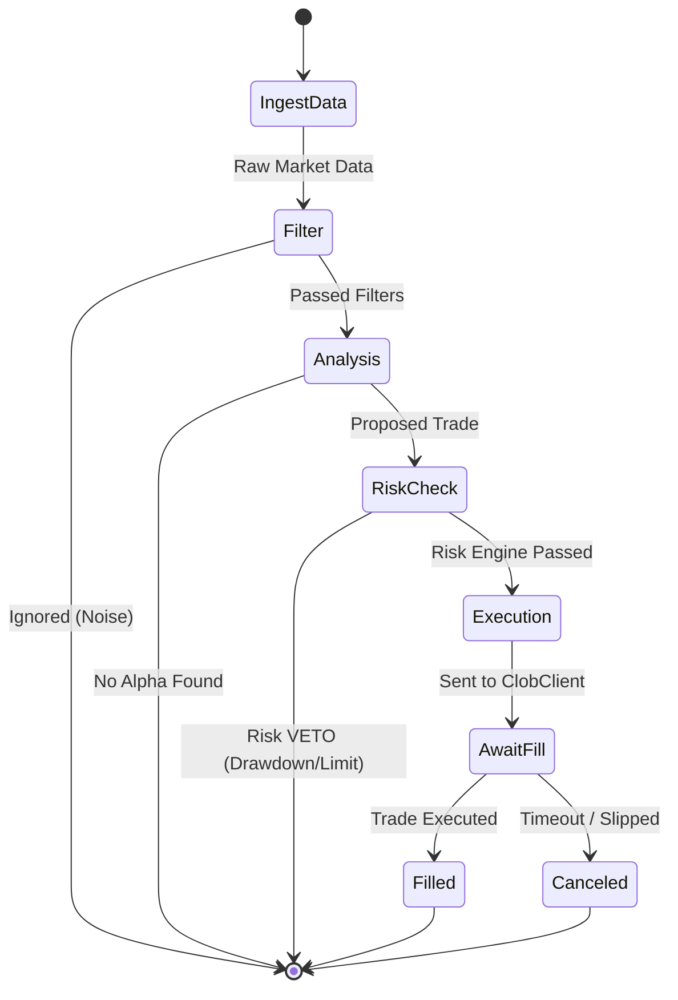

# Custom User Defined Strategy
**Strategy ID:** `user_defined`

## 📖 Overview
A sandboxed strategy template where the user can define ad-hoc rules without modifying core engine logic.

---

## 🏗️ Front-End / Back-End Workflow

This diagram illustrates the lifecycle of this strategy, from data ingestion to UI reflection.

---

## 🔍 Micro-Level Logic Diagram
This detailed diagram shows the internal decision tree the strategy executes on every tick.

---

## 📥 Inputs and 📤 Outputs

### Data Inputs (In)
- **Primary Source:** JSON Config Parameters, Evaluated Expressions
- **Environment:** `Live` or `Paper` state.
- **Risk Limits:** Max Drawdown, Max Position Size from Wallet Config.

### Data Outputs (Out)
- **Trade Signal:** User-specified Signal
- **Telemetry:** Logs routed to `AgentScrubber` (lessons_learned.md) on failure or success.